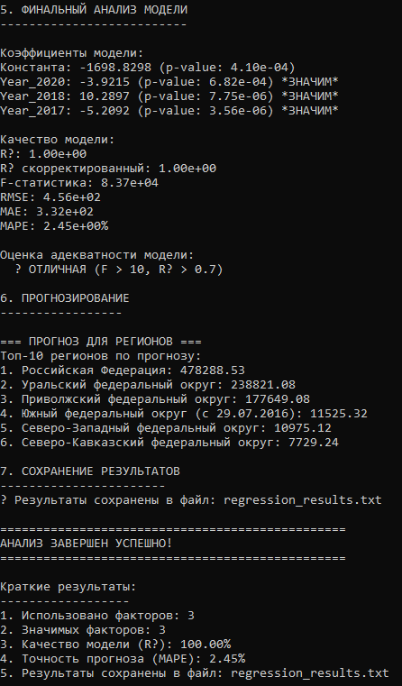

# Многофакторная линейная регрессионная модель (ЛМФМ) для нефтяных скважин (2010-2021)

## Цель работы и постановка задачи

Целью данной работы является **построение, анализ и оценка многофакторной линейной регрессионной модели (ЛМФМ)** для социально-экономических показателей регионов Российской Федерации на основе официальных данных Росстата.

В рамках работы решаются следующие задачи:

- загрузка и предварительная обработка табличных данных Росстата;
- формирование обучающей выборки: выбор целевого года (отклика) и факторов (предыдущие годы);
- построение многофакторной линейной регрессионной модели методом наименьших квадратов;
- статистическая оценка качества модели;
- проверка значимости факторов;
- анализ мультиколлинеарности факторов;
- прогнозирование значений показателя для регионов;
- сохранение результатов анализа в текстовый файл.

---

## Краткое описание процедуры построения и оценки ЛМФМ

### Подготовка данных

- Данные загружаются из CSV-файлов Росстата с разделителем `;`.
- Каждая строка соответствует региону РФ, столбцы — значения показателя по годам.
- Последний год временного ряда используется как **отклик (Y)**.
- Несколько предыдущих лет используются как **факторы (X)**.
- Наблюдения с пропущенными значениями автоматически исключаются.

### Построение модели

Используется многофакторная линейная регрессия вида:
`Y = β0 + β1·X1 + β2·X2 + ... + βk·Xk`

где:  
- `Y` — зависимая переменная (значение показателя в целевом году);  
- `X1, X2, ..., Xk` — независимые переменные (значения показателя за предыдущие годы);  
- `β0` — свободный член (константа);  
- `β1, β2, ..., βk` — оцениваемые коэффициенты регрессии.

Оценка коэффициентов производится методом **наименьших квадратов (МНК)** с применением библиотеки линейной алгебры **Eigen**.

### Оценка качества модели

Для итоговой модели рассчитываются следующие показатели:

- **R²** и **скорректированный R²** — доля объяснённой вариации;
- **F-статистика** — общая значимость модели;
- **RMSE** — среднеквадратичная ошибка;
- **MAE** — средняя абсолютная ошибка;
- **MAPE** — средняя абсолютная процентная ошибка прогноза.

### Статистический анализ факторов

- Для каждого коэффициента вычисляются стандартные ошибки, t-статистики и p-value.
- Факторы с `p-value < α` считаются статистически значимыми.
- Выполняется проверка **мультиколлинеарности** на основе корреляционной матрицы факторов.

### Прогнозирование

На основе итоговой модели выполняется прогноз значений показателя, формируется **топ-10 регионов** с наибольшими прогнозными значениями.

---

## Демонстрация работы программы

### Входные данные

- `DataV8.csv` — нефтяные скважины (2010–2021)

Формат входных данных:

Регион; Код; 2017 г.; 2018 г.; 2019 г.; 2020 г.;2021 г.

### Запуск программы

Программа реализована на языке **C++** и работает в консольном режиме:

1. Выбор файла с данными.
2. Ввод количества факторов.
3. Задание уровня значимости.
4. Интерактивный отбор факторов.
5. Получение итогового анализа и прогноза.

Основной файл программы:

👉 **[КОД](./cod.cpp)**

### Пример результатов

По результатам расчётов:

- все факторы оказались статистически значимыми;
- коэффициент детерминации **R² ≈ 0.99999**;
- средняя ошибка прогноза **MAPE ≈ 2.45%**;
- модель признана **отлично адекватной** по F-критерию.

### Выходные данные

Результаты автоматически сохраняются в файл:

- `regression_results.txt`

## Экраны / скриншоты работы программы

Пример вывода программы в консоли:

Файл содержит:

- коэффициенты регрессии и p-value;
- показатели качества модели;
- список значимых факторов;
- корреляции факторов с откликом;
- матрицу корреляций факторов.

---

## Используемые технологии

- Язык программирования: **C++**
- Линейная алгебра: **Eigen**
- Источник данных: **Росстат**
- Формат данных: **CSV**

---

## Итог

Разработанная программа реализует полный цикл многофакторного регрессионного анализа — от загрузки данных до получения прогноза и статистически обоснованных выводов. Полученная модель демонстрирует высокое качество аппроксимации и может быть использована для прикладных социально-экономических исследований.

